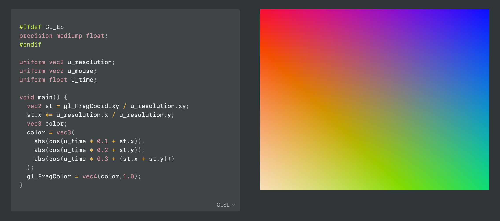

# Notion Embed Messenging

The code for the proof of concept of sending code from Notion to an embed. In this example the GLSL Fragment Shader code is sent to [the embed](https://notion-glsl.glitch.me/), which then renders it as an animation.

- For more info see here: https://www.notion.so/dtinth/Notion-Embed-messaging-7579535f5b2f441a89d2f85cf68d73f6
- Get the userscript here: [notion-embed-integration.user.js](https://github.com/dtinth/notion-embed-messenging/raw/master/notion-embed-integration.user.js)
